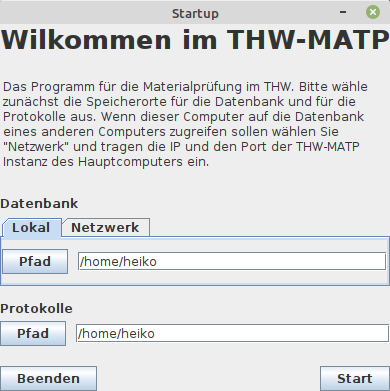
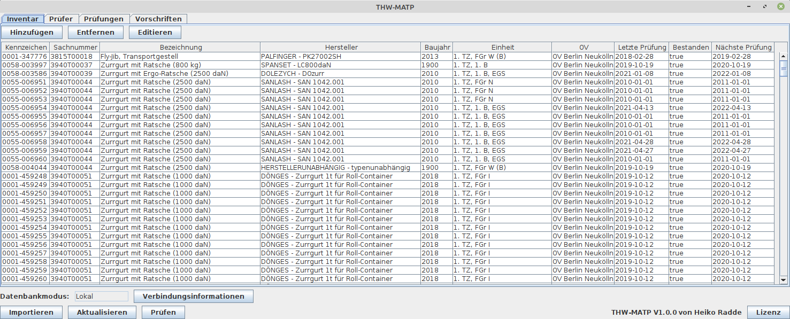
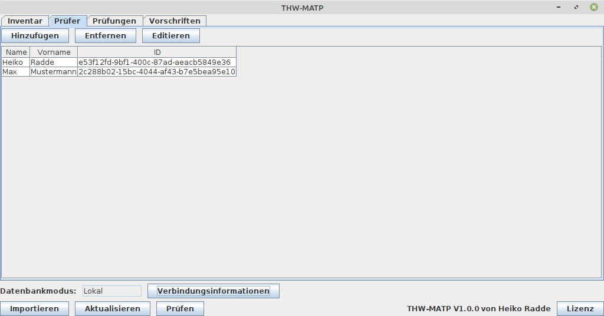
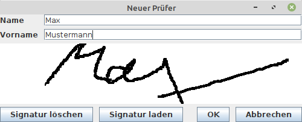
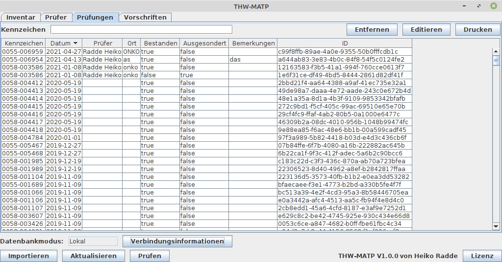
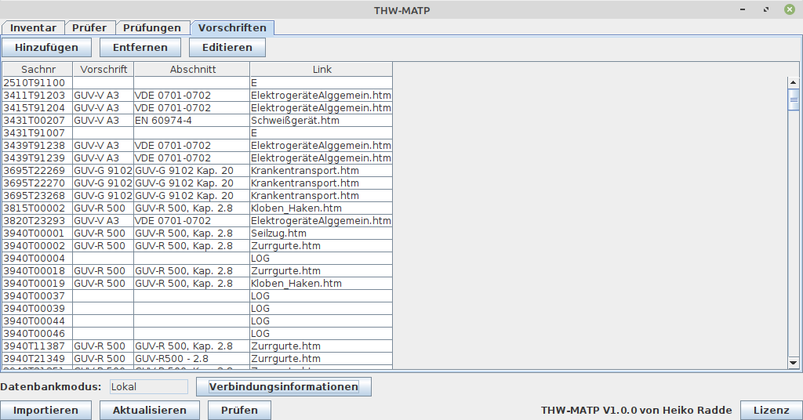
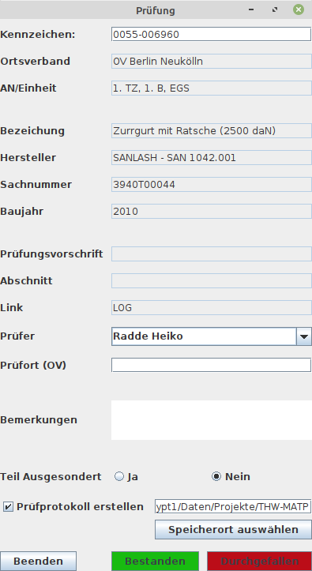
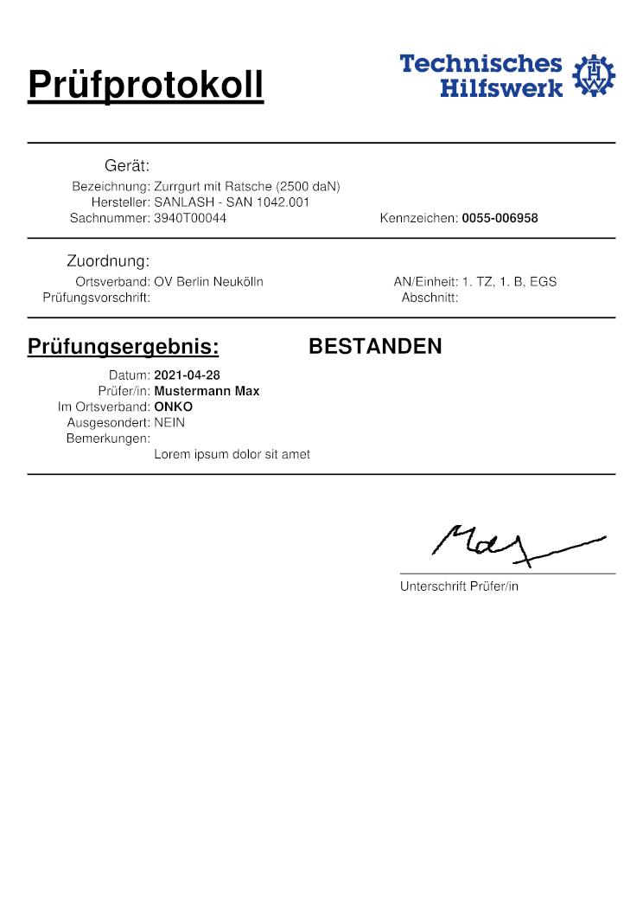
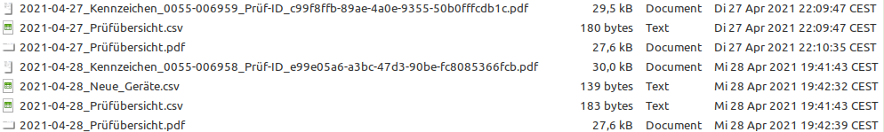

# THW-MATP Programm
Ein Programm für die Materialprüfung im THW.
Es verwaltet eine Datenbank über das Inventar und erstellt und speichert Prüfprotokolle.

## Features

- Verfügbar für Windows, Apple und Linux
- Inventarverwaltung
    - Speichere Kennzeichen, Sachnummer, Bezeichnung und Hersteller
    - Ordne Inventar Einheiten und Ortsverbänden zu
    - Import aus `CSV` Dateien möglich
- Durchführung von Prüfungen / Prüfungsverwaltung
    - Sämtliche Prüfungen eines Gerätes können abgefragt werden
    - Automatische Erstellung von Prüfprotokollen
        - Protokolle vergangener Prüfungen können erstellt werden
        - Übersicht über alle Prüfungen eines Tages als `PDF` und als `CSV`
        - Prüfungen werden Prüfern zugeteilt
- Gleichzeitige Nutzung der gleichen Datenbank von mehreren Computern aus möglich 

## Anleitung

## Installation

Das Programm muss entweder installiert werden (`.exe` oder `.deb` Dateien vom Release), oder ohne Installation ausgeführt werden (`.jar`).
Bei einer Installation werden keine anderen Programme benötigt.
Bei der Nutzung ohne Installation (`.jar` Datei) wird `Java` in der Version `14.0.2` oder höher benötigt.
Die Nutzung auf Systemen von Apple ist momentan nur ohne Installation möglich, Java wird also zwingend benötigt.

Das Programm wird unter https://github.com/HeikoRadde/THW-MATP/releases veröffentlicht.

## Programmstart

Bei Programmstart öffnet sich folgendes Felster:

Hier muss der Ordner, an dem die Protokolle gespeichert werden ausgewählt werden und welche Datenbank das Programm nutzen soll.
Über den Reiter `Netzwerk` kann die IP eines anderen Computers eingegeben werden, welcher die Datenbank lokal geöffnet hat.
Über den Reiter `Lokal` kann der Ordner ausgewählt werden, in dem die Datenbank vorhanden ist, oder (falls noch keine Datenbank existiert) in dem neue Datenbank angelegt werden soll.
Es muss entweder der Ordner unter `Lokal`, oder die Verbindungsinformationen eines anderen Computers (welcher selber die Datenbank lokal geöffnet hat) über `Netzwerk` eingegeben werden. 
Nachdem diese Einstellungen vorgenommen worden sind, kann über `Start` das Hauptfenster gestartet werden. 

Das Programm legt Inventar, Prüfer, Prüfungen und Vorschriften in eine Datenbank ab.
Diese Datei wird in dem ausgewählten Ordner angelegt bzw. aus diesem geladen.
Die Datenbank wird in der Datei `thw_matp_datenbank.mv.db` gespeichert.

Diese Datei kann bei Bedarf auch auf andere Computer kopiert und auf der THW-MATP Installation auf diesen genutzt werden.

## Hauptfenster

Das Hauptfenster bietet drei Reiter an: `Inventar`, `Prüfer`, `Prüfungen` und `Vorschriften`.
Diese Reiter dienen zur Darstellung und Verwaltung jener Teile der Datenbank.
Am unteren Rand des Fensters kann über den Button `Importieren` eine CSV Datei mit Daten zum Inventar (z.B. aus dem THWin) importiert werden.
Der Button `Aktualisieren` aktualisiert die momentan dargestellte Tabelle, nachdem z.B. neues Inventar oder neue Prüfer hinzugefügt worden sind.
Der Button `Prüfuen` startet eine Prüfung von Inventar, welches in der Datenbank vorhanden ist. 

### Reiter Inventar

Wenn dieser Reiter ausgewählt ist, dann wird das in der Datenbank hinterlegte Inventar angezeigt.
Neues Inventar kann über den Button `Hinzufügen` einzeln hinzugefügt werden.
Alternativ kann über den Button `Importieren` ein CSV-Datensatz mit mehreren Geräten gleichzeitig hinzugefügt werden. 
Bereits vorhandene Einträge (Geräte) können über die entsprechen benannten Buttons entfernt (permanent gelöscht) oder editiert werden.
Neu in die Datenbank aufgenommene Geräte werden in einer `CSV` Datei als Übersicht dokumentiert.
Der Name dieser Datei besteht aus dem aktuellen Datum und dem Schlagwort `Neue_Geräte`

ACHTUNG: beim Löschen eines Gerätes werden auch alle zu diesem Gerät gespeicherten Prüfungen gelöscht! 

#### Format der CSV Datei zum Importieren

Die vorderen 11 Spalten der CSV-Datei sollten wie folgt aussehen:

| OE                 | AN/Einheit  | Ausstattung                   | Sachnummer | Inventarnr.        | Gerätenr.  | Kennzeichen | Prüfung | Letzte | letztes Ergebnis | letzte Nr  |
| ------------------ | ----------- | ----------------------------- | ---------- | ------------------ | ---------- | ----------- | ------- | ------ | ---------------- | ---------- |
| OV Berlin Neukölln | 1. TZ, 1. B | Zurrgurt mit Ratsche (800 kg) | 2012       | SPANSET - LC800daN | 3940T00037 | 0058-003997 |         |        | BL-Zurrgurt      | 19.10.2019 |
 
 Dies ist das Format, welches durch den Export aus dem THWin entstehen sollte.
 Es können weitere Spalten folgen, wichtig ist, dass die vorderen Spalten wie oben angegeben sind.
 Die Daten in den Spalten entsprechen nicht immer dem Titel der Spalte.
 Die Daten sind pro Spalte wie folgt:
 
 1.  Ortsverband
 2.  Einheit
 3.  Name des Gerätes
 4.  Baujahr
 5.  Hersteller
 6.  Sachnummer (ID der Prüfvorschrift)
 7.  Kennzeichen des Gerätes
 8.  (Spalte nicht genutzt)
 9.  (Spalte nicht genutzt)
 10. (Spalte nicht genutzt)
 11. Datum der letzten Prüfung

### Reiter Prüfer

Prüfer können der Datenbank hinzugefügt werden.
Bei jeder Prüfung muss ein Prüfer angegeben werden.
Über den Reiter `Prüfer` können alle bekannte Prüfer angezeigt werden, neue hinzugefügt und bereits bestehende editiert oder entfernt werden

### Anlegen eines neuen Prüfers / Editieren eines bestehenden Prüfers

Beim Klicken auf den Button `Hinzufügen` im Reiter `Prüfer`  öffnet sich ein neues Fenster.
Möchte man einen bestehenden Prüfer editieren, so muss man diesen in der Tabelle auswählen und auf den Butten `Editieren` klicken.
Das sich danach öffnende Fenster sieht identisch zum Fenster zum Anlegen eines neuen Prüfers aus.

Für einen Prüfer müssen mindestens Name und Vorname angegeben sein.
Optional kann eine Unterschrift hinterlegt werden.
Entweder ein bestehender Scan (über den Button `Signatur laden`), oder durchs Zeichnen im weißen Fensterausschnitt.
Die Signatur wird den Prüfprotokollen hinzugefügt.

### Reiter Prüfungen

Unter dem Reiter `Prüfungen` werden alle bisherigen Prüfungen angezeigt.
Wenn im Feld neben `Kennzeichen` das Kennzeichen eines Gerätes eingegeben und mittels `Enter` bestätigt wird, dann kann nach allen Prüfungen dieses Gerätes gesucht werden.
Einzelne Prüfungen können in der Tabelle ausgewählt werden und anschließend über die entsprechenden Buttons entfernt, editiert oder erneut als `PDF` exportiert ("gedruckt") werden. 

### Reiter Vorschriften

Unter dem Reiter `Vorschriften` sind alle bekannten Prüfvorschriften zu finden.
Jedem Gerät des Inventars ist eine Vorschrift zugewiesen.
Wie in den anderen Reitern können auch hier neue Vorschriften hinzugefügt und vorhandene editiert oder entfernt werden.
Achtung: beim Entfernen einer Vorschrift werden alle Geräte des Inventars, welche jene Vorschrift nutzen, ebenfalls entfernt!

## Durchführen einer Prüfung

Eine Prüfung des im Programm hinterlegten Inventars wird über den Button `Prüfen` gestartet.
Es öffnet sich das hier angezeigte Fenster:

Zunächst muss das Kennzeichen vom zu prüfenden Gerät eingegeben werden und mit `Enter` bestätigt werden.
Wenn das Kennzeichen bekannt ist, dann werden die Daten zu diesem Gerät nun im Fenster angezeigt.
Falls das Kennzeichen noch nicht in der Datenbank hinterlegt ist, dann öffnet sich ein neues Dialogfenster, durch welches, falls gewünscht, jenes Gerät in die Datenbank eingetragen werden kann.
Für jedes Gerät, welches geprüft wird, muss nun im Fenster `Prüfung` angegeben werden, welcher Prüfer die Prüfung durchführt.
Es muss angegeben werden, ob das Teil nach der Prüfung ausgesondert wird, an welchem Ort die Prüfung stattfand, optional kann eine Bemerkung zur Prüfung hinterlegt werden.
Abschließend wird durch das Klicken auf den ensprechenden Button angegeben, ob das Gerät die Prüfung bestanden hat oder durchgefallen ist.

Nach dieser Auswahl kann direkt das Kennzeichen des nächsten Gerätes angegeben werden.
Es wird automatisch direkt das Suchfeld für das Kennzeichen ausgewählt und die Angaben zur Aussonderung und Bemerkung zurückgesetzt.
Die Auswahl des Prüfers und des Prüforts bleibt bestehen und muss für das nächste Gerät nicht zwingend erneut getätigt werden.

### Protokollierung

Jede Prüfung erstellt Prüfprotokolle:

Das Prüfprotokoll (`PDF`) eines jeden Gerätes trägt einen Namen bestehend aus dem Datum, dem Kennzeichen und der einzigartigen Prüf-ID.
Ebenfalls wird eine Übersicht über alle Prüfungen des Tages als `CSV` Datei erstellt, ihr Name besteht aus dem aktuellen Datum und dem Wort `Prüfübersicht`
Wenn das THW-MATP Programm geschlossen wird, dann wird diese `CSV` Datei ebenso als eine `PDF` Datei exportiert.

